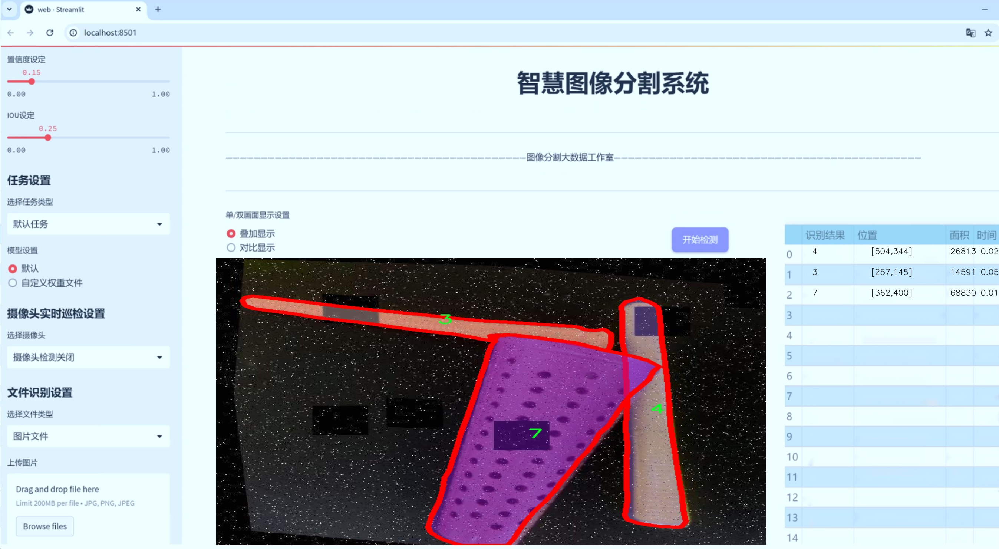
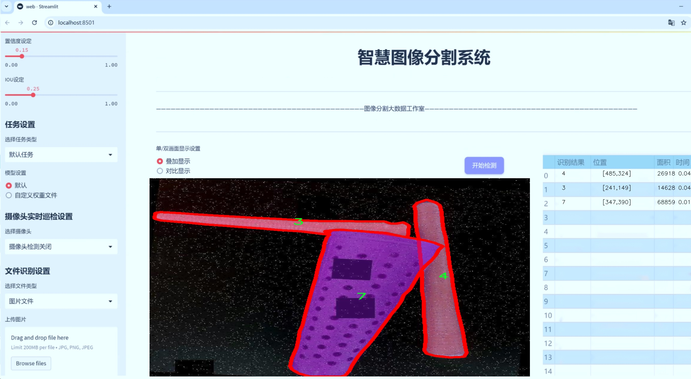
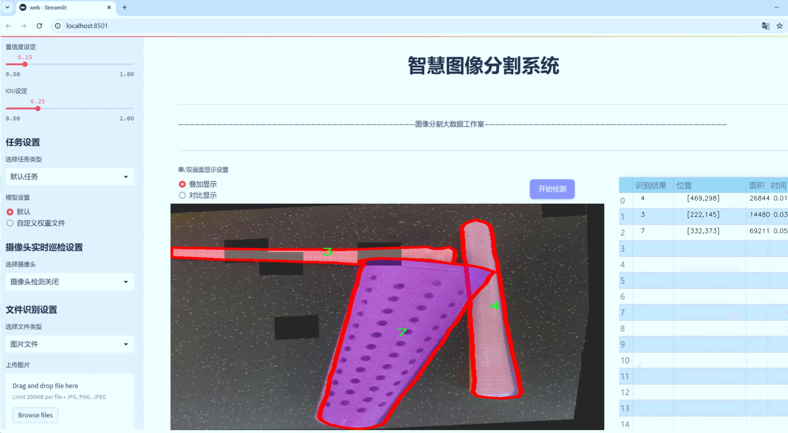
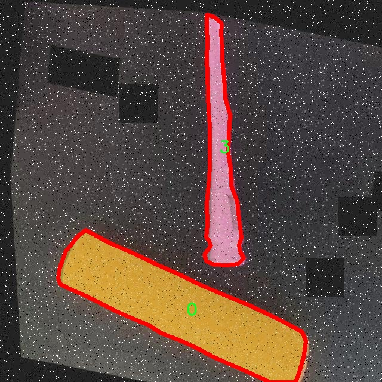
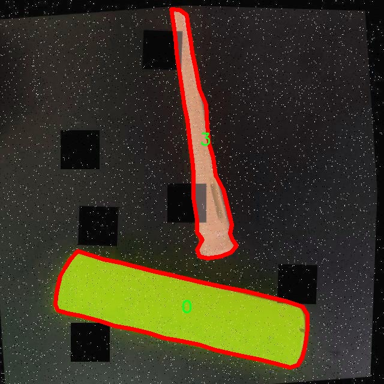
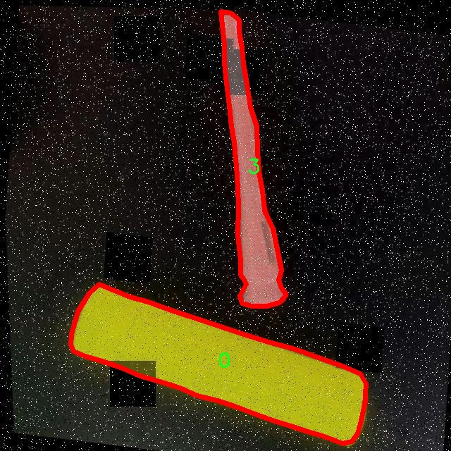
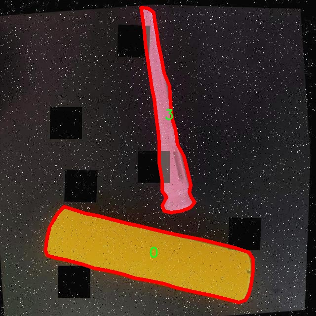
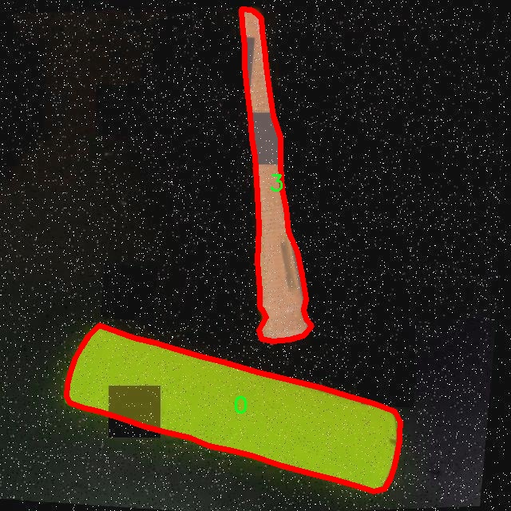

# yarn线圈分割系统源码＆数据集分享
 [yolov8-seg-C2f-Faster-EMA＆yolov8-seg-attention等50+全套改进创新点发刊_一键训练教程_Web前端展示]

### 1.研究背景与意义

项目参考[ILSVRC ImageNet Large Scale Visual Recognition Challenge](https://gitee.com/YOLOv8_YOLOv11_Segmentation_Studio/projects)

项目来源[AAAI Global Al lnnovation Contest](https://kdocs.cn/l/cszuIiCKVNis)

研究背景与意义

随着纺织工业的快速发展，yarn（纱线）作为纺织品的基本原料，其生产和质量控制的重要性日益凸显。在纱线生产过程中，线圈的分割与识别是确保产品质量和生产效率的关键环节。传统的线圈分割方法多依赖人工操作或基于简单的图像处理技术，这不仅效率低下，而且容易受到人为因素的影响，导致分割精度不足。随着深度学习技术的迅猛发展，基于计算机视觉的自动化线圈分割系统逐渐成为研究热点。

在众多深度学习模型中，YOLO（You Only Look Once）系列因其高效的实时目标检测能力而备受关注。YOLOv8作为该系列的最新版本，进一步提升了检测精度和速度，尤其在实例分割任务中表现出色。通过对YOLOv8进行改进，我们可以更好地适应纱线线圈的特征，进而实现高效、准确的线圈分割。这一研究不仅具有重要的理论意义，还有助于推动纺织行业的智能化转型。

本研究基于一个包含4100张图像的yarn_out数据集，数据集中涵盖了8个不同类别的线圈，能够为模型的训练和测试提供丰富的样本。这些样本的多样性和复杂性为改进YOLOv8提供了良好的基础，使得模型能够学习到不同线圈在形状、颜色和纹理等方面的特征。通过对数据集的深入分析，我们可以发现不同类别线圈之间的相似性与差异性，从而为模型的优化提供指导。

此外，线圈分割系统的研究还具有广泛的应用前景。通过实现高效的线圈分割，不仅可以提高生产线的自动化水平，降低人工成本，还能在质量控制中提供更为精确的数据支持。随着智能制造和工业4.0的推进，纺织行业亟需引入先进的技术手段，以提升整体竞争力。基于改进YOLOv8的线圈分割系统，正是响应这一需求的重要尝试。

总之，本研究旨在通过改进YOLOv8模型，构建一个高效的yarn线圈分割系统，以实现对纱线生产过程的智能化管理。研究不仅将推动计算机视觉技术在纺织行业的应用，也将为相关领域的研究提供新的思路和方法。通过这一研究，我们期望能够为纺织行业的数字化转型贡献力量，同时为后续的研究提供坚实的基础。

### 2.图片演示







##### 注意：由于此博客编辑较早，上面“2.图片演示”和“3.视频演示”展示的系统图片或者视频可能为老版本，新版本在老版本的基础上升级如下：（实际效果以升级的新版本为准）

  （1）适配了YOLOV8的“目标检测”模型和“实例分割”模型，通过加载相应的权重（.pt）文件即可自适应加载模型。

  （2）支持“图片识别”、“视频识别”、“摄像头实时识别”三种识别模式。

  （3）支持“图片识别”、“视频识别”、“摄像头实时识别”三种识别结果保存导出，解决手动导出（容易卡顿出现爆内存）存在的问题，识别完自动保存结果并导出到tempDir中。

  （4）支持Web前端系统中的标题、背景图等自定义修改，后面提供修改教程。

  另外本项目提供训练的数据集和训练教程,暂不提供权重文件（best.pt）,需要您按照教程进行训练后实现图片演示和Web前端界面演示的效果。

### 3.视频演示

[3.1 视频演示](https://www.bilibili.com/video/BV1oGmFYQEHh/)

### 4.数据集信息展示

##### 4.1 本项目数据集详细数据（类别数＆类别名）

nc: 8
names: ['0', '1', '2', '3', '4', '5', '6', '7']


##### 4.2 本项目数据集信息介绍

数据集信息展示

在本研究中，我们使用了名为“yarn_out”的数据集，以训练和改进YOLOv8-seg模型，旨在实现高效的yarn线圈分割系统。该数据集的设计和构建是为了满足特定的图像分割需求，尤其是在纺织行业中，yarn线圈的精确识别和分割对于后续的自动化处理至关重要。数据集的类别数量为8，具体类别列表包括：'0', '1', '2', '3', '4', '5', '6', '7'。这些类别代表了不同类型的yarn线圈，每个类别的样本均经过精心挑选和标注，以确保模型训练的有效性和准确性。

“yarn_out”数据集的样本来源广泛，涵盖了多种不同的yarn线圈形态和颜色。这种多样性使得数据集能够更好地反映实际应用场景中的复杂性。每个类别的样本不仅在视觉特征上存在差异，而且在光照、背景和线圈排列等方面也有所不同，这为模型的泛化能力提供了良好的训练基础。数据集中的图像均经过高质量的处理，确保了清晰度和细节的完整性，从而为YOLOv8-seg模型的训练提供了理想的输入。

在数据集的构建过程中，我们采用了多种数据增强技术，以提高模型的鲁棒性和适应性。这些技术包括旋转、缩放、裁剪和颜色变换等，旨在模拟不同的拍摄条件和环境变化。通过这种方式，我们能够有效地扩展数据集的规模，使得模型在面对未见过的样本时，依然能够保持较高的识别准确率。

为了确保数据集的标注质量，我们邀请了多位领域专家对每个样本进行审核和修正，确保每个类别的标注准确无误。这一过程不仅提高了数据集的可靠性，也为后续的模型训练奠定了坚实的基础。通过精确的标注，我们能够为YOLOv8-seg模型提供清晰的学习目标，使其在训练过程中能够有效地学习到各个类别的特征。

在训练过程中，我们将“yarn_out”数据集分为训练集、验证集和测试集，以便于对模型的性能进行全面评估。训练集用于模型的学习，验证集用于调参和选择最佳模型，而测试集则用于最终的性能评估。通过这种分割方式，我们能够有效地避免过拟合现象，并确保模型在实际应用中的表现。

总之，“yarn_out”数据集的构建和应用为改进YOLOv8-seg的yarn线圈分割系统提供了强有力的支持。通过丰富的样本、多样的类别和高质量的标注，我们期望该数据集能够帮助模型在复杂的实际环境中实现高效、准确的yarn线圈分割，为纺织行业的自动化进程贡献力量。随着研究的深入，我们相信该数据集将成为相关领域的重要参考，为后续的研究和应用提供宝贵的数据支持。











### 5.全套项目环境部署视频教程（零基础手把手教学）

[5.1 环境部署教程链接（零基础手把手教学）](https://www.bilibili.com/video/BV1jG4Ve4E9t/?vd_source=bc9aec86d164b67a7004b996143742dc)


[5.2 安装Python虚拟环境创建和依赖库安装视频教程链接（零基础手把手教学）](https://www.bilibili.com/video/BV1nA4VeYEze/?vd_source=bc9aec86d164b67a7004b996143742dc)

### 6.手把手YOLOV8-seg训练视频教程（零基础小白有手就能学会）

[6.1 手把手YOLOV8-seg训练视频教程（零基础小白有手就能学会）](https://www.bilibili.com/video/BV1cA4VeYETe/?vd_source=bc9aec86d164b67a7004b996143742dc)


按照上面的训练视频教程链接加载项目提供的数据集，运行train.py即可开始训练



     Epoch   gpu_mem       box       obj       cls    labels  img_size
     1/200     0G   0.01576   0.01955  0.007536        22      1280: 100%|██████████| 849/849 [14:42<00:00,  1.04s/it]
               Class     Images     Labels          P          R     mAP@.5 mAP@.5:.95: 100%|██████████| 213/213 [01:14<00:00,  2.87it/s]
                 all       3395      17314      0.994      0.957      0.0957      0.0843

     Epoch   gpu_mem       box       obj       cls    labels  img_size
     2/200     0G   0.01578   0.01923  0.007006        22      1280: 100%|██████████| 849/849 [14:44<00:00,  1.04s/it]
               Class     Images     Labels          P          R     mAP@.5 mAP@.5:.95: 100%|██████████| 213/213 [01:12<00:00,  2.95it/s]
                 all       3395      17314      0.996      0.956      0.0957      0.0845

     Epoch   gpu_mem       box       obj       cls    labels  img_size
     3/200     0G   0.01561    0.0191  0.006895        27      1280: 100%|██████████| 849/849 [10:56<00:00,  1.29it/s]
               Class     Images     Labels          P          R     mAP@.5 mAP@.5:.95: 100%|███████   | 187/213 [00:52<00:00,  4.04it/s]
                 all       3395      17314      0.996      0.957      0.0957      0.0845


### 7.50+种全套YOLOV8-seg创新点代码加载调参视频教程（一键加载写好的改进模型的配置文件）

[7.1 50+种全套YOLOV8-seg创新点代码加载调参视频教程（一键加载写好的改进模型的配置文件）](https://www.bilibili.com/video/BV1Hw4VePEXv/?vd_source=bc9aec86d164b67a7004b996143742dc)

### 8.YOLOV8-seg图像分割算法原理

原始YOLOv8-seg算法原理

YOLOv8-seg算法是Ultralytics公司在2023年推出的YOLO系列最新版本，标志着目标检测和图像分割领域的一次重要进步。该算法在YOLOv5至YOLOv7的基础上，融合了多项创新设计，旨在提升模型的性能、灵活性和易用性。YOLOv8-seg不仅能够进行目标检测，还能进行精确的图像分割，这使得它在实际应用中更具广泛性和适应性。

YOLOv8-seg的网络结构由三个主要部分组成：输入层（Input）、主干网络（Backbone）和检测头（Head）。在输入层，YOLOv8-seg采用640x640的默认图像尺寸进行处理，但在实际应用中，为了适应不同长宽比的图像，算法引入了自适应图像缩放技术。这种技术的核心思想是将图像的长边按比例缩小至指定尺寸后，对短边进行填充，以减少信息冗余和填充带来的影响。此外，在训练阶段，YOLOv8-seg还采用了Mosaic数据增强技术，通过随机拼接多张图像来生成新的训练样本，从而增强模型的泛化能力和鲁棒性。

在主干网络部分，YOLOv8-seg对YOLOv5中的C3模块进行了创新性改进，采用了C2F模块。这一模块借鉴了YOLOv7中的ELAN设计思想，允许更多的梯度流分支并行处理，从而在保持轻量化的同时获得更丰富的特征信息。C2F模块的结构设计旨在提高特征提取的效率，确保模型在处理复杂场景时仍能保持高精度。

YOLOv8-seg的Neck部分同样经历了重要的改进。相较于YOLOv5，YOLOv8-seg在Neck中去除了多余的上采样卷积层，直接将主干网络不同阶段输出的特征进行上采样。这种简化设计不仅提高了计算效率，还降低了模型的复杂性，使得YOLOv8-seg在实际应用中更为高效。

在检测头部分，YOLOv8-seg的变化尤为显著。它采用了Decoupled-Head结构，将目标检测和分类任务解耦，使得模型在处理不同任务时能够更加灵活。通过将输入特征图分别通过两个1x1卷积层进行降维，YOLOv8-seg能够独立进行类别预测和边界框回归。此外，YOLOv8-seg抛弃了传统的Anchor-Based方法，转而采用Anchor-Free策略。这一创新使得模型不再依赖于预设的锚框，而是将目标检测问题转化为关键点检测问题，极大地简化了模型的设计，并提高了检测的速度和准确性。

在损失函数的设计上，YOLOv8-seg也进行了优化。它在分类分支中采用了二值交叉熵损失（BCELoss），而在边界框回归分支中则使用了分布焦点损失（DFL）和CIoU损失。这种组合损失函数的设计目的在于使得模型能够更快地聚焦于目标的真实位置，提高预测的精度。

YOLOv8-seg的创新之处不仅体现在网络结构的设计上，还体现在其训练过程中的数据增强策略和样本分配策略。通过动态的任务对齐样本分配，YOLOv8-seg能够在训练过程中更有效地利用每一批次的数据，提高模型的学习效率。

总的来说，YOLOv8-seg算法通过一系列的结构优化和策略创新，成功地提升了目标检测和图像分割的性能。其自适应图像缩放、Mosaic数据增强、C2F模块、Decoupled-Head结构以及Anchor-Free检测方法等一系列创新，使得YOLOv8-seg在复杂场景下依然能够保持高效的处理能力和准确的检测效果。这些改进不仅使得YOLOv8-seg在理论上具有更强的竞争力，也为实际应用提供了更为可靠的技术支持。随着YOLOv8-seg的推广和应用，目标检测和图像分割的技术水平有望得到进一步提升，为各类智能视觉系统的实现奠定坚实的基础。


### 9.系统功能展示（检测对象为举例，实际内容以本项目数据集为准）

图9.1.系统支持检测结果表格显示

  图9.2.系统支持置信度和IOU阈值手动调节

  图9.3.系统支持自定义加载权重文件best.pt(需要你通过步骤5中训练获得)

  图9.4.系统支持摄像头实时识别

  图9.5.系统支持图片识别

  图9.6.系统支持视频识别

  图9.7.系统支持识别结果文件自动保存

  图9.8.系统支持Excel导出检测结果数据


### 10.50+种全套YOLOV8-seg创新点原理讲解（非科班也可以轻松写刊发刊，V11版本正在科研待更新）

#### 10.1 由于篇幅限制，每个创新点的具体原理讲解就不一一展开，具体见下列网址中的创新点对应子项目的技术原理博客网址【Blog】：


[10.1 50+种全套YOLOV8-seg创新点原理讲解链接](https://gitee.com/qunmasj/good)

#### 10.2 部分改进模块原理讲解(完整的改进原理见上图和技术博客链接)【如果此小节的图加载失败可以通过CSDN或者Github搜索该博客的标题访问原始博客，原始博客图片显示正常】
### 可变性卷积DCN简介
卷积神经网络由于其构建模块中固定的几何结构，本质上受限于模型几何变换。为了提高卷积神经网络的转换建模能力，《Deformable Convolutional Networks》作者提出了两个模块：可变形卷积（deformable convolution）和可变形RoI池（deformable RoI pooling）。这两个模块均基于用额外的偏移来增加模块中的空间采样位置以及从目标任务中学习偏移的思想，而不需要额外的监督。

第一次证明了在深度神经网络中学习密集空间变换（dense spatial transformation）对于复杂的视觉任务是有效的

视觉识别中的一个关键挑战是如何适应对象比例、姿态、视点和零件变形中的几何变化或模型几何变换。一般有两种方法实现：
1）建立具有足够期望变化的训练数据集。这通常通过增加现有的数据样本来实现，例如通过仿射变换。但是训练成本昂贵而且模型参数庞大。
2）使用变换不变（transformation-invariant）的特征和算法。比如比较有名的SIFT(尺度不变特征变换)便是这一类的代表算法。

但以上的方法有两个缺点：
1）几何变换被假定为固定的和已知的，这些先验知识被用来扩充数据，设计特征和算法。为此，这个假设阻止了对具有未知几何变换的新任务的推广，从而导致这些几何变换可能没有被正确建模。
2）对于不变特征和算法进行手动设计，对于过于复杂的变换可能是困难的或不可行的。

卷积神经网络本质上局限于模拟大型未知转换。局限性源于CNN模块的固定几何结构：卷积单元在固定位置对输入特征图进行采样；池化层以固定比率降低特征矩阵分辨率；RoI（感兴趣区域）池化层将RoI分成固定的空间箱（spatial bins）等。缺乏处理几何变换的内部机制。

这种内部机制的缺乏会导致一些问题，举个例子。同一个CNN层中所有激活单元的感受野大小是相同的，但是这是不可取的。因为不同的位置可能对应于具有不同尺度或变形的对象，所以尺度或感受野大小的自适应确定对于具有精细定位的视觉识别是渴望的。

对于这些问题，作者提出了两个模块提高CNNs对几何变换建模的能力。


deformable convolution（可变形卷积）
将2D偏移量添加到标准卷积中的常规网格采样位置，使得采样网格能够自由变形。通过额外的卷积层，从前面的特征映射中学习偏移。因此，变形采用局部、密集和自适应的方式取决于输入特征。


deformable RoI pooling（可变形RoI池化）
为先前RoI池化的常规库（bin）分区中的每个库位置（bin partition）增加了一个偏移量。类似地，偏移是从前面的特征图和感兴趣区域中学习的，从而能够对具有不同形状的对象进行自适应部件定位（adaptive part localization）。

#### Deformable Convolutional Networks
Deformable Convolution
2D卷积由两个步骤组成：
1）在输入特征图x xx上使用规则网格R RR进行采样。
2）把这些采样点乘不同权重w ww后相加。

网格R定义感受野大小和扩张程度，比如内核大小为3x3，扩张程度为1的网格R可以表示为：
R = { ( − 1 , − 1 ) , ( − 1 , 0 ) , … , ( 0 , 1 ) , ( 1 , 1 ) } R = \{(-1,-1),(-1,0),\dots,(0,1),(1,1)\}
R={(−1,−1),(−1,0),…,(0,1),(1,1)}

​
 一般为小数，使用双线性插值进行处理。（把小数坐标分解到相邻的四个整数坐标点来计算结果）


具体操作如图所示：


首先对输入特征层进行一个普通的3x3卷积处理得到偏移域（offset field）。偏移域特征图具有与输入特征图相同的空间分辨率，channels维度2N对应于N个2D（xy两个方向）偏移。其中的N是原输入特征图上所具有的N个channels，也就是输入输出channels保持不变，这里xy两个channels分别对输出特征图上的一个channels进行偏移。确定采样点后就通过与相对应的权重w点乘相加得到输出特征图上该点最终值。

前面也提到过，由于这里xy两个方向所训练出来的偏移量一般来说是一个小数，那么为了得到这个点所对应的数值，会采用双线性插值的方法，从最近的四个邻近坐标点中计算得到该偏移点的数值，公式如下：


具体推理过程见：双线性插值原理

#### Deformable RoI Poolingb
所有基于区域提议（RPN）的对象检测方法都使用RoI池话处理，将任意大小的输入矩形区域转换为固定大小的特征图。


 一般为小数，需要使用双线性插值进行处理。


具体操作如图所示：


当时看这个部分的时候觉得有些突兀，明明RoI池化会将特征层转化为固定尺寸的区域。其实，我个人觉得，这个部分与上述的可变性卷积操作是类似的。这里同样是使用了一个普通的RoI池化操作，进行一些列处理后得到了一个偏移域特征图，然后重新作用于原来的w × H w \times Hw×H的RoI。只不过这里不再是规律的逐行逐列对每个格子进行池化，而是对于格子进行偏移后再池化处理。

#### Postion﹣Sensitive RoI Pooling
除此之外，论文还提出一种PS RoI池化（Postion﹣Sensitive RoI Pooling）。不同于上述可变形RoI池化中的全连接过程，这里使用全卷积替换。

具体操作如图所示：


首先，对于原来的特征图来说，原本是将输入特征图上的RoI区域分成k × k k\times kk×k个bin。而在这里，则是将输入特征图进行卷积操作，分别得到一个channels为k 2 ( C + 1 ) k^{2}(C+1)k (C+1)的得分图（score maps）和一个channels为2 k 2 ( C + 1 ) 2k{2}(C+1)2k 2 (C+1)的偏移域（offset fields），这两个特征矩阵的宽高是与输入特征矩阵相同的。其中，得分图的channels中，k × k k \times kk×k分别表示的是每一个网格，C CC表示的检测对象的类别数目，1表示背景。而在偏移域中的2表示xy两个方向的偏移。
也就是说，在PS RoI池化中，对于RoI的每一个网格都独自占一个通道形成一层得分图，然后其对于的偏移量占两个通道。offset fields得到的偏移是归一化后的偏移，需要通过和deformable RoI pooling中一样的变换方式得到∆ p i j ∆p_{ij}∆p ij，然后对每层得分图进行偏移池化处理。最后处理完的结果就对应着最后输出的一个网格。所以其包含了位置信息。

原文论述为：


#### Understanding Deformable ConvNets
当可变形卷积叠加时，复合变形的效果是深远的。如图所示：


ps：a是标准卷积的固定感受野，b是可变形卷积的适应性感受野。

感受野和标准卷积中的采样位置在整个顶部特征图上是固定的(左)。在可变形卷积中，它们根据对象的比例和形状进行自适应调整(右)。


### 11.项目核心源码讲解（再也不用担心看不懂代码逻辑）

#### 11.1 ultralytics\models\rtdetr\train.py

以下是对给定代码的核心部分进行提炼和详细注释的结果：

```python
# Ultralytics YOLO 🚀, AGPL-3.0 license

import torch
from copy import copy
from ultralytics.models.yolo.detect import DetectionTrainer
from ultralytics.nn.tasks import RTDETRDetectionModel
from ultralytics.utils import RANK, colorstr
from .val import RTDETRDataset, RTDETRValidator

class RTDETRTrainer(DetectionTrainer):
    """
    RT-DETR模型的训练类，继承自YOLO的DetectionTrainer类，适应RT-DETR的特性和架构。
    RT-DETR模型利用视觉变换器，具备IoU感知查询选择和可适应的推理速度等能力。
    """

    def get_model(self, cfg=None, weights=None, verbose=True):
        """
        初始化并返回用于目标检测任务的RT-DETR模型。

        Args:
            cfg (dict, optional): 模型配置，默认为None。
            weights (str, optional): 预训练模型权重的路径，默认为None。
            verbose (bool): 如果为True，则输出详细日志，默认为True。

        Returns:
            (RTDETRDetectionModel): 初始化后的模型。
        """
        # 创建RT-DETR检测模型实例
        model = RTDETRDetectionModel(cfg, nc=self.data['nc'], verbose=verbose and RANK == -1)
        if weights:
            model.load(weights)  # 加载预训练权重
        return model

    def build_dataset(self, img_path, mode='val', batch=None):
        """
        构建并返回用于训练或验证的RT-DETR数据集。

        Args:
            img_path (str): 包含图像的文件夹路径。
            mode (str): 数据集模式，可以是'train'或'val'。
            batch (int, optional): 矩形训练的批量大小，默认为None。

        Returns:
            (RTDETRDataset): 针对特定模式的数据集对象。
        """
        # 创建RT-DETR数据集实例
        return RTDETRDataset(img_path=img_path,
                             imgsz=self.args.imgsz,
                             batch_size=batch,
                             augment=mode == 'train',  # 训练模式下进行数据增强
                             hyp=self.args,
                             rect=False,
                             cache=self.args.cache or None,
                             prefix=colorstr(f'{mode}: '),  # 添加模式前缀
                             data=self.data)

    def get_validator(self):
        """
        返回适合RT-DETR模型验证的检测验证器。

        Returns:
            (RTDETRValidator): 用于模型验证的验证器对象。
        """
        self.loss_names = 'giou_loss', 'cls_loss', 'l1_loss'  # 定义损失名称
        return RTDETRValidator(self.test_loader, save_dir=self.save_dir, args=copy(self.args))

    def preprocess_batch(self, batch):
        """
        预处理一批图像。缩放并将图像转换为浮点格式。

        Args:
            batch (dict): 包含一批图像、边界框和标签的字典。

        Returns:
            (dict): 预处理后的批次数据。
        """
        batch = super().preprocess_batch(batch)  # 调用父类的预处理方法
        bs = len(batch['img'])  # 获取批次大小
        batch_idx = batch['batch_idx']  # 获取批次索引
        gt_bbox, gt_class = [], []  # 初始化真实边界框和类别列表
        for i in range(bs):
            # 根据批次索引提取每个图像的真实边界框和类别
            gt_bbox.append(batch['bboxes'][batch_idx == i].to(batch_idx.device))
            gt_class.append(batch['cls'][batch_idx == i].to(device=batch_idx.device, dtype=torch.long))
        return batch  # 返回预处理后的批次数据
```

### 代码分析与注释说明：
1. **类定义**：`RTDETRTrainer` 继承自 `DetectionTrainer`，用于实现RT-DETR模型的训练逻辑。
2. **模型初始化**：`get_model` 方法用于创建和加载RT-DETR模型，支持自定义配置和预训练权重。
3. **数据集构建**：`build_dataset` 方法根据指定的模式（训练或验证）构建数据集，并进行必要的参数设置。
4. **验证器获取**：`get_validator` 方法返回一个验证器实例，用于评估模型性能。
5. **批次预处理**：`preprocess_batch` 方法对输入的图像批次进行预处理，提取真实的边界框和类别信息。

以上代码和注释突出了RT-DETR训练过程中的关键功能和实现细节。

这个文件是一个用于训练RT-DETR模型的Python脚本，RT-DETR是百度开发的一种实时目标检测模型。该脚本继承自YOLO的DetectionTrainer类，并对其进行了特定的调整，以适应RT-DETR的特性和架构。RT-DETR模型结合了视觉变换器（Vision Transformers）技术，具备IoU（Intersection over Union）感知的查询选择和可调的推理速度等功能。

在文件开头，导入了一些必要的库和模块，包括PyTorch、YOLO的检测训练器、RT-DETR模型以及数据集和验证器。接着定义了RTDETRTrainer类，类中包含了多个方法。

`get_model`方法用于初始化并返回一个RT-DETR模型。它接受模型配置、预训练权重路径和是否进行详细日志记录的参数。如果提供了权重路径，模型会加载相应的权重。

`build_dataset`方法用于构建并返回一个RT-DETR数据集，支持训练和验证模式。该方法接收图像路径、模式（训练或验证）和批量大小作为参数，并返回一个RTDETRDataset对象。

`get_validator`方法返回一个适用于RT-DETR模型验证的检测验证器。该方法还定义了损失名称，包括giou损失、分类损失和L1损失。

`preprocess_batch`方法用于预处理一批图像，将图像缩放并转换为浮点格式。它从父类中调用预处理方法，并对每个图像的边界框和类别进行处理，确保它们与当前设备兼容。

整个类的设计旨在提供一个灵活的框架，以便于训练RT-DETR模型，并支持不同的数据集和训练配置。通过实例化RTDETRTrainer类并调用其`train`方法，用户可以轻松开始训练过程。

#### 11.2 ui.py

```python
import sys
import subprocess

def run_script(script_path):
    """
    使用当前 Python 环境运行指定的脚本。

    Args:
        script_path (str): 要运行的脚本路径

    Returns:
        None
    """
    # 获取当前 Python 解释器的路径
    python_path = sys.executable

    # 构建运行命令
    command = f'"{python_path}" -m streamlit run "{script_path}"'

    # 执行命令
    result = subprocess.run(command, shell=True)
    if result.returncode != 0:
        print("脚本运行出错。")


# 实例化并运行应用
if __name__ == "__main__":
    # 指定您的脚本路径
    script_path = "web.py"  # 这里直接指定脚本名称

    # 运行脚本
    run_script(script_path)
```

### 代码注释

1. **导入模块**：
   - `import sys`：导入系统相关的模块，用于获取当前 Python 解释器的路径。
   - `import subprocess`：导入子进程模块，用于在 Python 中执行外部命令。

2. **定义函数 `run_script`**：
   - 函数接受一个参数 `script_path`，表示要运行的 Python 脚本的路径。
   - 函数内部首先获取当前 Python 解释器的路径，并存储在 `python_path` 变量中。
   - 然后构建一个命令字符串 `command`，该命令使用当前 Python 解释器运行 `streamlit` 模块，并指定要运行的脚本。
   - 使用 `subprocess.run` 执行构建的命令。如果命令执行返回的状态码不为 0，表示脚本运行出错，打印错误信息。

3. **主程序块**：
   - `if __name__ == "__main__":`：确保只有在直接运行该脚本时才会执行以下代码。
   - 指定要运行的脚本路径 `script_path`，这里直接指定为 `"web.py"`。
   - 调用 `run_script` 函数，传入脚本路径，执行该脚本。

这个程序文件的主要功能是通过当前的 Python 环境来运行一个指定的脚本，具体来说是运行一个名为 `web.py` 的脚本。程序首先导入了必要的模块，包括 `sys`、`os` 和 `subprocess`，以及一个自定义的路径处理模块 `abs_path`。

在 `run_script` 函数中，首先获取当前 Python 解释器的路径，这样可以确保使用正确的 Python 环境来执行脚本。接着，构建一个命令字符串，这个命令会调用 `streamlit` 模块来运行指定的脚本。`streamlit` 是一个用于构建数据应用的库，通常用于快速开发和展示数据可视化应用。

然后，使用 `subprocess.run` 方法来执行构建好的命令。这个方法会在一个新的 shell 中运行命令，并等待其完成。如果命令执行后返回的状态码不为零，表示脚本运行出错，程序会打印出相应的错误信息。

在文件的最后部分，使用 `if __name__ == "__main__":` 语句来确保只有在直接运行该文件时才会执行下面的代码。这部分代码指定了要运行的脚本路径，即 `web.py`，并调用 `run_script` 函数来执行这个脚本。

总体来说，这个程序的目的是提供一个简单的接口，通过命令行运行一个 Streamlit 应用，方便用户在当前的 Python 环境中启动和调试该应用。

#### 11.3 ultralytics\trackers\basetrack.py

以下是代码中最核心的部分，并附上详细的中文注释：

```python
from collections import OrderedDict
import numpy as np

class TrackState:
    """对象跟踪状态的枚举类。"""
    New = 0      # 新跟踪
    Tracked = 1  # 正在跟踪
    Lost = 2     # 跟踪丢失
    Removed = 3  # 跟踪已移除

class BaseTrack:
    """对象跟踪的基类，处理基本的跟踪属性和操作。"""

    _count = 0  # 全局跟踪ID计数器

    track_id = 0          # 当前跟踪的ID
    is_activated = False   # 跟踪是否被激活
    state = TrackState.New # 当前跟踪状态

    history = OrderedDict() # 存储跟踪历史的有序字典
    features = []           # 存储特征的列表
    curr_feature = None     # 当前特征
    score = 0              # 跟踪得分
    start_frame = 0        # 跟踪开始的帧
    frame_id = 0           # 当前帧ID
    time_since_update = 0   # 自上次更新以来的时间

    # 多摄像头支持
    location = (np.inf, np.inf) # 跟踪对象的位置，初始化为无穷大

    @property
    def end_frame(self):
        """返回跟踪的最后帧ID。"""
        return self.frame_id

    @staticmethod
    def next_id():
        """递增并返回全局跟踪ID计数器。"""
        BaseTrack._count += 1
        return BaseTrack._count

    def activate(self, *args):
        """使用提供的参数激活跟踪。"""
        raise NotImplementedError  # 该方法需要在子类中实现

    def predict(self):
        """预测跟踪的下一个状态。"""
        raise NotImplementedError  # 该方法需要在子类中实现

    def update(self, *args, **kwargs):
        """使用新的观测数据更新跟踪。"""
        raise NotImplementedError  # 该方法需要在子类中实现

    def mark_lost(self):
        """将跟踪标记为丢失。"""
        self.state = TrackState.Lost

    def mark_removed(self):
        """将跟踪标记为已移除。"""
        self.state = TrackState.Removed

    @staticmethod
    def reset_id():
        """重置全局跟踪ID计数器。"""
        BaseTrack._count = 0
```

### 代码核心部分说明：
1. **TrackState类**：定义了跟踪状态的枚举，包括新跟踪、正在跟踪、丢失和已移除状态。
2. **BaseTrack类**：这是一个对象跟踪的基类，包含了跟踪对象的基本属性和方法。
   - 属性包括跟踪ID、激活状态、跟踪状态、历史记录、特征、得分、起始帧、当前帧ID、更新间隔时间等。
   - `next_id`静态方法用于生成唯一的跟踪ID。
   - `activate`、`predict`和`update`方法是抽象方法，需在子类中实现具体逻辑。
   - `mark_lost`和`mark_removed`方法用于更新跟踪状态。
   - `reset_id`静态方法用于重置跟踪ID计数器。

这个程序文件是一个用于对象跟踪的基础类，名为 `BaseTrack`，它定义了一些跟踪对象的基本属性和操作。文件中还包含一个枚举类 `TrackState`，用于表示跟踪状态，包括新建、跟踪中、丢失和已移除四种状态。

在 `BaseTrack` 类中，定义了一些类属性和实例属性。类属性 `_count` 用于跟踪全局的跟踪 ID 计数器，`track_id` 是当前跟踪对象的 ID，`is_activated` 表示该跟踪对象是否已激活，`state` 表示当前的跟踪状态，初始状态为新建。`history` 是一个有序字典，用于存储跟踪历史，`features` 列表用于存储特征，`curr_feature` 是当前特征，`score` 是跟踪的评分，`start_frame` 和 `frame_id` 分别表示跟踪开始的帧和当前帧，`time_since_update` 表示自上次更新以来的时间。`location` 属性用于多摄像头跟踪，初始值为无穷大。

类中定义了一个属性 `end_frame`，用于返回跟踪的最后一帧 ID。`next_id` 静态方法用于递增并返回全局跟踪 ID 计数器，确保每个跟踪对象都有唯一的 ID。

`activate`、`predict` 和 `update` 方法是需要子类实现的抽象方法，分别用于激活跟踪、预测下一个状态和更新跟踪对象。`mark_lost` 和 `mark_removed` 方法用于将跟踪对象标记为丢失或已移除，更新其状态。

最后，`reset_id` 静态方法用于重置全局跟踪 ID 计数器，通常在需要重新开始跟踪时使用。

总体来说，这个文件提供了一个基础的跟踪类，供其他具体的跟踪实现进行扩展和使用。

#### 11.4 ultralytics\utils\__init__.py

以下是经过简化和注释的核心代码部分：

```python
import os
import platform
import logging
from pathlib import Path
import yaml

# 定义常量
ROOT = Path(__file__).resolve().parents[1]  # 获取项目根目录
DEFAULT_CFG_PATH = ROOT / 'cfg/default.yaml'  # 默认配置文件路径

# 设置日志
def set_logging(name='ultralytics', verbose=True):
    """设置日志记录的配置"""
    level = logging.INFO if verbose else logging.ERROR  # 根据verbose设置日志级别
    logging.basicConfig(level=level, format='%(message)s')  # 设置日志格式

# 加载YAML文件
def yaml_load(file='data.yaml'):
    """从YAML文件加载数据"""
    with open(file, 'r', encoding='utf-8') as f:
        return yaml.safe_load(f)  # 使用安全加载方式读取YAML内容

# 保存YAML文件
def yaml_save(file='data.yaml', data=None):
    """将数据保存到YAML文件"""
    with open(file, 'w', encoding='utf-8') as f:
        yaml.safe_dump(data, f, sort_keys=False)  # 将数据以YAML格式写入文件

# 默认配置加载
DEFAULT_CFG_DICT = yaml_load(DEFAULT_CFG_PATH)  # 从默认配置文件加载配置
DEFAULT_CFG = SimpleNamespace(**DEFAULT_CFG_DICT)  # 将配置转换为命名空间对象，方便访问

# 检查操作系统类型
def is_ubuntu() -> bool:
    """检查当前操作系统是否为Ubuntu"""
    return platform.system() == 'Linux' and 'ubuntu' in platform.uname().release.lower()

# 初始化日志
set_logging(verbose=True)  # 设置日志记录
```

### 代码注释说明：
1. **常量定义**：
   - `ROOT`：获取当前文件的父目录作为项目根目录。
   - `DEFAULT_CFG_PATH`：定义默认配置文件的路径。

2. **日志设置**：
   - `set_logging`：配置日志记录，包括日志级别和格式。

3. **YAML文件操作**：
   - `yaml_load`：从指定的YAML文件中加载数据，返回为字典格式。
   - `yaml_save`：将数据以YAML格式保存到指定文件中。

4. **默认配置加载**：
   - `DEFAULT_CFG_DICT`：从默认配置文件加载配置。
   - `DEFAULT_CFG`：将加载的配置转换为命名空间对象，方便后续使用。

5. **操作系统检查**：
   - `is_ubuntu`：检查当前操作系统是否为Ubuntu。

6. **日志初始化**：
   - 调用`set_logging`函数以初始化日志记录。

以上是核心代码部分及其详细注释，提供了对主要功能的理解和使用。

这个程序文件是Ultralytics YOLO项目的一个工具模块，主要用于提供一些通用的功能和设置，支持YOLO模型的训练、验证和推理等操作。文件的开头包含了一些必要的导入，包括标准库和第三方库，像`torch`、`cv2`、`yaml`等，这些库在计算机视觉和深度学习中非常常用。

首先，文件定义了一些常量和全局变量，比如多GPU训练的相关参数、文件路径、线程数、自动安装和详细输出模式的设置等。通过环境变量的方式，用户可以自定义这些设置。接着，文件中定义了一些帮助函数和类，比如自定义的`tqdm`类用于进度条显示，`SimpleClass`和`IterableSimpleNamespace`类用于简化对象的字符串表示和属性访问。

文件中还包含了一些用于处理YAML文件的函数，比如`yaml_save`和`yaml_load`，它们分别用于将数据保存为YAML格式和从YAML文件中加载数据。此外，还有`yaml_print`函数用于美观地打印YAML内容。

在设置方面，文件会加载默认配置并提供相应的管理功能。通过`SettingsManager`类，用户可以方便地读取和更新配置文件中的设置。

此外，文件中定义了一些环境检测函数，比如`is_ubuntu`、`is_colab`、`is_kaggle`等，用于判断当前运行环境，以便于在不同环境下做出相应的调整。

在错误处理方面，文件提供了`TryExcept`类，可以作为装饰器或上下文管理器使用，方便捕获和处理异常。

文件的最后部分会进行一些初始化操作，比如设置日志记录、检查安装状态、应用补丁等。通过这些功能，用户可以更方便地使用YOLO模型进行各种计算机视觉任务。

总的来说，这个文件是Ultralytics YOLO工具的核心部分，提供了丰富的功能和灵活的配置选项，旨在提高用户的使用体验和模型的训练效率。

#### 11.5 ultralytics\nn\extra_modules\kernel_warehouse.py

以下是经过简化和注释的核心代码部分，主要保留了 `Attention` 和 `KWConvNd` 类的实现，注释详细解释了每个部分的功能和逻辑。

```python
import torch
import torch.nn as nn
import torch.nn.functional as F

class Attention(nn.Module):
    def __init__(self, in_planes, reduction, num_static_cell, num_local_mixture, norm_layer=nn.BatchNorm1d,
                 cell_num_ratio=1.0, nonlocal_basis_ratio=1.0, start_cell_idx=None):
        super(Attention, self).__init__()
        # 计算隐藏层的通道数
        hidden_planes = max(int(in_planes * reduction), 16)
        self.kw_planes_per_mixture = num_static_cell + 1  # 每个混合物的通道数
        self.num_local_mixture = num_local_mixture  # 本地混合物的数量
        self.kw_planes = self.kw_planes_per_mixture * num_local_mixture  # 总的通道数

        # 计算本地和非本地单元的数量
        self.num_local_cell = int(cell_num_ratio * num_local_mixture)
        self.num_nonlocal_cell = num_static_cell - self.num_local_cell
        self.start_cell_idx = start_cell_idx

        # 定义层
        self.avgpool = nn.AdaptiveAvgPool1d(1)  # 自适应平均池化
        self.fc1 = nn.Linear(in_planes, hidden_planes, bias=(norm_layer is not nn.BatchNorm1d))  # 全连接层
        self.norm1 = norm_layer(hidden_planes)  # 归一化层
        self.act1 = nn.ReLU(inplace=True)  # 激活函数

        # 根据非本地基数比率选择映射方式
        if nonlocal_basis_ratio >= 1.0:
            self.map_to_cell = nn.Identity()  # 直接映射
            self.fc2 = nn.Linear(hidden_planes, self.kw_planes, bias=True)  # 全连接层
        else:
            self.map_to_cell = self.map_to_cell_basis  # 使用基于映射
            self.num_basis = max(int(self.num_nonlocal_cell * nonlocal_basis_ratio), 16)  # 基础单元数量
            self.fc2 = nn.Linear(hidden_planes, (self.num_local_cell + self.num_basis + 1) * num_local_mixture, bias=False)
            self.fc3 = nn.Linear(self.num_basis, self.num_nonlocal_cell, bias=False)  # 处理非本地单元的全连接层
            self.basis_bias = nn.Parameter(torch.zeros([self.kw_planes], requires_grad=True).float())  # 基础偏置

        self.temp_bias = torch.zeros([self.kw_planes], requires_grad=False).float()  # 温度偏置
        self.temp_value = 0  # 温度值
        self._initialize_weights()  # 初始化权重

    def _initialize_weights(self):
        # 初始化权重
        for m in self.modules():
            if isinstance(m, nn.Linear):
                nn.init.kaiming_normal_(m.weight, mode='fan_out', nonlinearity='relu')  # Kaiming初始化
                if m.bias is not None:
                    nn.init.constant_(m.bias, 0)  # 偏置初始化为0
            if isinstance(m, nn.BatchNorm1d):
                nn.init.constant_(m.weight, 1)  # 归一化权重初始化为1
                nn.init.constant_(m.bias, 0)  # 偏置初始化为0

    def forward(self, x):
        # 前向传播
        x = self.avgpool(x.reshape(*x.shape[:2], -1)).squeeze(dim=-1)  # 池化
        x = self.act1(self.norm1(self.fc1(x)))  # 线性变换 -> 归一化 -> 激活
        x = self.map_to_cell(self.fc2(x)).reshape(-1, self.kw_planes)  # 映射到单元
        x = x / (torch.sum(torch.abs(x), dim=1).view(-1, 1) + 1e-3)  # 归一化
        x = (1.0 - self.temp_value) * x + self.temp_value * self.temp_bias.to(x.device).view(1, -1)  # 温度调整
        return x.reshape(-1, self.kw_planes_per_mixture)[:, :-1]  # 返回结果

class KWconvNd(nn.Module):
    def __init__(self, in_planes, out_planes, kernel_size, stride=1, padding=0, dilation=1, groups=1,
                 bias=False, warehouse_id=None, warehouse_manager=None):
        super(KWconvNd, self).__init__()
        self.in_planes = in_planes  # 输入通道数
        self.out_planes = out_planes  # 输出通道数
        self.kernel_size = kernel_size  # 卷积核大小
        self.stride = stride  # 步幅
        self.padding = padding  # 填充
        self.dilation = dilation  # 膨胀
        self.groups = groups  # 分组卷积
        self.bias = nn.Parameter(torch.zeros([self.out_planes]), requires_grad=True).float() if bias else None  # 偏置
        self.warehouse_id = warehouse_id  # 仓库ID
        self.warehouse_manager = [warehouse_manager]  # 仓库管理器

    def forward(self, x):
        # 前向传播
        kw_attention = self.attention(x).type(x.dtype)  # 获取注意力权重
        batch_size = x.shape[0]  # 批大小
        x = x.reshape(1, -1, *x.shape[2:])  # 重塑输入
        weight = self.warehouse_manager[0].take_cell(self.warehouse_id).reshape(self.cell_shape[0], -1).type(x.dtype)  # 获取权重
        aggregate_weight = torch.mm(kw_attention, weight)  # 加权
        output = self.func_conv(x, weight=aggregate_weight, bias=None, stride=self.stride, padding=self.padding,
                                dilation=self.dilation, groups=self.groups * batch_size)  # 卷积操作
        output = output.view(batch_size, self.out_planes, *output.shape[2:])  # 重塑输出
        if self.bias is not None:
            output = output + self.bias.reshape(1, -1, *([1]*self.dimension))  # 添加偏置
        return output  # 返回输出
```

### 代码说明
1. **Attention 类**:
   - 该类实现了一个注意力机制，主要用于计算输入特征的加权表示。
   - 初始化方法中定义了多个线性层和归一化层，构建了注意力机制的核心结构。
   - `forward` 方法实现了前向传播，计算注意力权重并返回。

2. **KWconvNd 类**:
   - 该类实现了一个可扩展的卷积层，支持动态权重管理。
   - 在初始化中定义了输入输出通道、卷积核大小、步幅等参数。
   - `forward` 方法实现了卷积操作，结合了注意力机制的输出和动态权重。

以上代码为核心部分，展示了如何使用注意力机制和动态卷积层来构建神经网络模块。

这个程序文件`kernel_warehouse.py`主要实现了一个用于深度学习模型的核仓库管理系统，特别是在卷积神经网络中。文件中定义了多个类和函数，主要包括`Attention`、`KWconvNd`、`KWConv1d`、`KWConv2d`、`KWConv3d`、`KWLinear`、`Warehouse_Manager`和`KWConv`等。

首先，`parse`函数用于处理输入参数，确保其格式符合要求。如果输入是一个可迭代对象，它会根据指定的数量`n`返回一个列表，确保列表的长度为1或`n`。这个函数在后续的类中被广泛使用，以确保卷积层的参数设置正确。

`Attention`类实现了一个注意力机制，主要用于动态调整卷积核的权重。它的构造函数中定义了多个参数，包括输入通道数、减少比率、静态单元数、局部混合数等。该类的`forward`方法计算输入的注意力权重，并根据温度值和其他参数调整输出。

`KWconvNd`类是一个通用的卷积层类，支持1D、2D和3D卷积。它的构造函数接受输入和输出通道数、卷积核大小、步幅、填充、扩张等参数，并初始化注意力机制。`forward`方法中，首先计算注意力权重，然后从仓库中获取卷积核权重，最后执行卷积操作。

`KWConv1d`、`KWConv2d`和`KWConv3d`类分别继承自`KWconvNd`，实现了一维、二维和三维卷积的具体功能，定义了各自的维度和卷积函数。

`KWLinear`类实现了一个线性层，内部使用`KWConv1d`来处理输入数据，适用于需要线性变换的场景。

`Warehouse_Manager`类是核仓库的管理器，负责管理和分配卷积核。它的构造函数接受多个参数，包括减少比率、单元数比率、共享范围等。该类提供了`reserve`方法，用于创建卷积层而不分配权重，并记录相关信息。`store`方法用于存储权重，并根据输入参数计算各层的权重形状。`allocate`方法则负责在网络中分配权重，确保每个卷积层的注意力机制得到正确初始化。

最后，`KWConv`类是一个简单的卷积层封装，结合了核仓库管理器和标准的卷积操作，提供了更高层次的接口。

此外，文件中还定义了一个`get_temperature`函数，用于根据当前迭代次数和训练周期计算温度值，这在动态调整模型参数时非常有用。

整体来看，这个文件实现了一个灵活的卷积核管理系统，通过注意力机制和仓库管理，能够有效地优化卷积神经网络的性能。

#### 11.6 train.py

以下是代码中最核心的部分，并附上详细的中文注释：

```python
import os
import torch
import yaml
from ultralytics import YOLO  # 导入YOLO模型库

if __name__ == '__main__':  # 确保该模块被直接运行时才执行以下代码
    # 设置训练参数
    workers = 1  # 数据加载的工作进程数
    batch = 8  # 每个批次的样本数量，需根据显存/内存调整
    device = "0" if torch.cuda.is_available() else "cpu"  # 判断是否使用GPU

    # 获取数据集的yaml配置文件的绝对路径
    data_path = abs_path(f'datasets/data/data.yaml', path_type='current')  

    # 获取目录路径
    directory_path = os.path.dirname(data_path.replace(os.sep, '/'))

    # 读取YAML文件，保持原有顺序
    with open(data_path, 'r') as file:
        data = yaml.load(file, Loader=yaml.FullLoader)

    # 修改数据集路径
    if 'train' in data and 'val' in data and 'test' in data:
        data['train'] = directory_path + '/train'  # 设置训练集路径
        data['val'] = directory_path + '/val'      # 设置验证集路径
        data['test'] = directory_path + '/test'    # 设置测试集路径

        # 将修改后的数据写回YAML文件
        with open(data_path, 'w') as file:
            yaml.safe_dump(data, file, sort_keys=False)

    # 加载YOLO模型配置文件和预训练权重
    model = YOLO(r"C:\codeseg\codenew\50+种YOLOv8算法改进源码大全和调试加载训练教程（非必要）\改进YOLOv8模型配置文件\yolov8-seg-C2f-Faster.yaml").load("./weights/yolov8s-seg.pt")

    # 开始训练模型
    results = model.train(
        data=data_path,  # 指定训练数据的配置文件路径
        device=device,  # 使用指定的设备进行训练
        workers=workers,  # 使用的工作进程数
        imgsz=640,  # 输入图像的大小为640x640
        epochs=100,  # 训练100个epoch
        batch=batch,  # 每个批次的大小
    )
```

### 代码核心部分解释：
1. **导入必要的库**：导入了操作系统、PyTorch、YAML处理库和YOLO模型库。
2. **设置训练参数**：定义了工作进程数、批次大小和设备类型（GPU或CPU）。
3. **读取和修改数据集配置**：读取YAML文件，修改训练、验证和测试集的路径，并将其写回文件。
4. **加载YOLO模型**：指定模型的配置文件和预训练权重。
5. **训练模型**：调用模型的训练方法，传入数据路径、设备、工作进程数、图像大小、训练轮数和批次大小等参数。

这个程序文件`train.py`主要用于训练YOLO（You Only Look Once）模型，具体是YOLOv8的一个变种，进行目标检测或分割任务。代码的主要流程如下：

首先，程序导入了必要的库，包括`os`、`torch`、`yaml`和`ultralytics`中的YOLO模型。`matplotlib`库被设置为使用'TkAgg'后端，以便于图形界面的显示。

在`__main__`块中，程序首先定义了一些训练参数，如工作进程数`workers`、批次大小`batch`、以及设备类型`device`。`device`会根据当前是否有可用的GPU来选择，如果有GPU则使用GPU（标记为"0"），否则使用CPU。

接下来，程序通过`abs_path`函数获取数据集配置文件`data.yaml`的绝对路径，并将路径中的分隔符统一为Unix风格的斜杠。然后，程序提取出数据集的目录路径。

程序打开`data.yaml`文件并读取其内容，使用`yaml`库保持原有的顺序。接着，程序检查YAML文件中是否包含'train'、'val'和'test'三个键，如果存在，则将这些键的值修改为相应的训练、验证和测试数据的绝对路径，并将修改后的内容写回到YAML文件中。

在模型加载部分，程序创建了一个YOLO模型实例，并加载指定的配置文件和预训练权重。这里提到不同模型的大小和设备要求可能不同，如果当前模型在设备上运行时出现错误，可以尝试使用其他模型配置文件。

最后，程序调用`model.train()`方法开始训练模型，传入训练数据的配置文件路径、设备类型、工作进程数、输入图像大小、训练的epoch数量和批次大小等参数。训练过程会根据这些参数进行设置，并开始执行。

整体来看，这段代码的功能是配置并启动YOLOv8模型的训练过程，涉及到数据路径的处理、模型的加载以及训练参数的设置。

### 12.系统整体结构（节选）

### 整体功能和构架概括

整个项目主要围绕目标检测和分割任务构建，采用了YOLO和RT-DETR等先进的深度学习模型。项目的架构分为多个模块，每个模块负责特定的功能，形成一个完整的训练、验证和推理流程。以下是项目的主要组成部分：

1. **模型训练**：`train.py`和`ultralytics\models\rtdetr\train.py`负责模型的训练过程，配置数据集和模型参数。
2. **用户界面**：`ui.py`提供了一个简单的用户界面，用于启动和管理模型训练或推理。
3. **跟踪模块**：`ultralytics\trackers\basetrack.py`实现了对象跟踪的基础类，供后续具体跟踪实现使用。
4. **工具函数**：`ultralytics\utils\__init__.py`包含了各种通用工具函数和配置管理功能，支持整个项目的运行。
5. **额外模块**：`ultralytics\nn\extra_modules\kernel_warehouse.py`、`ultralytics\nn\extra_modules\orepa.py`和`ultralytics\nn\extra_modules\attention.py`等实现了深度学习模型中的特定功能，如卷积核管理、注意力机制等。
6. **数据处理**：`ultralytics\data\dataset.py`负责数据集的加载和处理，确保训练和验证数据的正确性。
7. **验证模块**：`ultralytics\engine\validator.py`实现了模型验证的功能，评估模型在验证集上的表现。
8. **下载模块**：`ultralytics\utils\downloads.py`提供了模型权重和数据集的下载功能，确保用户能够获取所需资源。

### 文件功能整理表

| 文件路径                                                   | 功能描述                                                 |
|----------------------------------------------------------|--------------------------------------------------------|
| `ultralytics\models\rtdetr\train.py`                    | 负责RT-DETR模型的训练过程，包含模型和数据集的初始化。         |
| `ui.py`                                                 | 提供用户界面，允许用户启动和管理模型训练或推理。              |
| `ultralytics\trackers\basetrack.py`                     | 实现对象跟踪的基础类，定义跟踪对象的属性和操作。               |
| `ultralytics\utils\__init__.py`                         | 包含通用工具函数和配置管理功能，支持整个项目的运行。           |
| `ultralytics\nn\extra_modules\kernel_warehouse.py`     | 实现卷积核管理系统，支持动态调整卷积核的权重和注意力机制。      |
| `train.py`                                             | 负责YOLO模型的训练过程，配置数据集和模型参数。                |
| `ultralytics\nn\backbone\SwinTransformer.py`           | 实现Swin Transformer模型，作为YOLO模型的骨干网络。             |
| `ultralytics\nn\extra_modules\orepa.py`                | 实现OREPA（Object Re-Identification with Efficient Perception Attention）模块，优化目标检测性能。 |
| `ultralytics\utils\downloads.py`                        | 提供模型权重和数据集的下载功能，确保用户获取所需资源。         |
| `ultralytics\data\dataset.py`                           | 负责数据集的加载和处理，确保训练和验证数据的正确性。           |
| `ultralytics\nn\extra_modules\ops_dcnv3\functions\__init__.py` | 实现DCNv3（Deformable Convolutional Networks v3）相关功能，支持模型的灵活性。 |
| `ultralytics\engine\validator.py`                       | 实现模型验证功能，评估模型在验证集上的表现。                   |
| `ultralytics\nn\extra_modules\attention.py`             | 实现注意力机制，增强模型对重要特征的关注能力。                  |

这个表格总结了项目中各个文件的主要功能，展示了它们在整个目标检测和分割任务中的作用。

注意：由于此博客编辑较早，上面“11.项目核心源码讲解（再也不用担心看不懂代码逻辑）”中部分代码可能会优化升级，仅供参考学习，完整“训练源码”、“Web前端界面”和“50+种创新点源码”以“14.完整训练+Web前端界面+50+种创新点源码、数据集获取”的内容为准。

### 13.图片、视频、摄像头图像分割Demo(去除WebUI)代码

在这个博客小节中，我们将讨论如何在不使用WebUI的情况下，实现图像分割模型的使用。本项目代码已经优化整合，方便用户将分割功能嵌入自己的项目中。
核心功能包括图片、视频、摄像头图像的分割，ROI区域的轮廓提取、类别分类、周长计算、面积计算、圆度计算以及颜色提取等。
这些功能提供了良好的二次开发基础。

### 核心代码解读

以下是主要代码片段，我们会为每一块代码进行详细的批注解释：

```python
import random
import cv2
import numpy as np
from PIL import ImageFont, ImageDraw, Image
from hashlib import md5
from model import Web_Detector
from chinese_name_list import Label_list

# 根据名称生成颜色
def generate_color_based_on_name(name):
    ......

# 计算多边形面积
def calculate_polygon_area(points):
    return cv2.contourArea(points.astype(np.float32))

...
# 绘制中文标签
def draw_with_chinese(image, text, position, font_size=20, color=(255, 0, 0)):
    image_pil = Image.fromarray(cv2.cvtColor(image, cv2.COLOR_BGR2RGB))
    draw = ImageDraw.Draw(image_pil)
    font = ImageFont.truetype("simsun.ttc", font_size, encoding="unic")
    draw.text(position, text, font=font, fill=color)
    return cv2.cvtColor(np.array(image_pil), cv2.COLOR_RGB2BGR)

# 动态调整参数
def adjust_parameter(image_size, base_size=1000):
    max_size = max(image_size)
    return max_size / base_size

# 绘制检测结果
def draw_detections(image, info, alpha=0.2):
    name, bbox, conf, cls_id, mask = info['class_name'], info['bbox'], info['score'], info['class_id'], info['mask']
    adjust_param = adjust_parameter(image.shape[:2])
    spacing = int(20 * adjust_param)

    if mask is None:
        x1, y1, x2, y2 = bbox
        aim_frame_area = (x2 - x1) * (y2 - y1)
        cv2.rectangle(image, (x1, y1), (x2, y2), color=(0, 0, 255), thickness=int(3 * adjust_param))
        image = draw_with_chinese(image, name, (x1, y1 - int(30 * adjust_param)), font_size=int(35 * adjust_param))
        y_offset = int(50 * adjust_param)  # 类别名称上方绘制，其下方留出空间
    else:
        mask_points = np.concatenate(mask)
        aim_frame_area = calculate_polygon_area(mask_points)
        mask_color = generate_color_based_on_name(name)
        try:
            overlay = image.copy()
            cv2.fillPoly(overlay, [mask_points.astype(np.int32)], mask_color)
            image = cv2.addWeighted(overlay, 0.3, image, 0.7, 0)
            cv2.drawContours(image, [mask_points.astype(np.int32)], -1, (0, 0, 255), thickness=int(8 * adjust_param))

            # 计算面积、周长、圆度
            area = cv2.contourArea(mask_points.astype(np.int32))
            perimeter = cv2.arcLength(mask_points.astype(np.int32), True)
            ......

            # 计算色彩
            mask = np.zeros(image.shape[:2], dtype=np.uint8)
            cv2.drawContours(mask, [mask_points.astype(np.int32)], -1, 255, -1)
            color_points = cv2.findNonZero(mask)
            ......

            # 绘制类别名称
            x, y = np.min(mask_points, axis=0).astype(int)
            image = draw_with_chinese(image, name, (x, y - int(30 * adjust_param)), font_size=int(35 * adjust_param))
            y_offset = int(50 * adjust_param)

            # 绘制面积、周长、圆度和色彩值
            metrics = [("Area", area), ("Perimeter", perimeter), ("Circularity", circularity), ("Color", color_str)]
            for idx, (metric_name, metric_value) in enumerate(metrics):
                ......

    return image, aim_frame_area

# 处理每帧图像
def process_frame(model, image):
    pre_img = model.preprocess(image)
    pred = model.predict(pre_img)
    det = pred[0] if det is not None and len(det)
    if det:
        det_info = model.postprocess(pred)
        for info in det_info:
            image, _ = draw_detections(image, info)
    return image

if __name__ == "__main__":
    cls_name = Label_list
    model = Web_Detector()
    model.load_model("./weights/yolov8s-seg.pt")

    # 摄像头实时处理
    cap = cv2.VideoCapture(0)
    while cap.isOpened():
        ret, frame = cap.read()
        if not ret:
            break
        ......

    # 图片处理
    image_path = './icon/OIP.jpg'
    image = cv2.imread(image_path)
    if image is not None:
        processed_image = process_frame(model, image)
        ......

    # 视频处理
    video_path = ''  # 输入视频的路径
    cap = cv2.VideoCapture(video_path)
    while cap.isOpened():
        ret, frame = cap.read()
        ......
```


### 14.完整训练+Web前端界面+50+种创新点源码、数据集获取


# [下载链接：D:\Temporary](D:\Temporary)